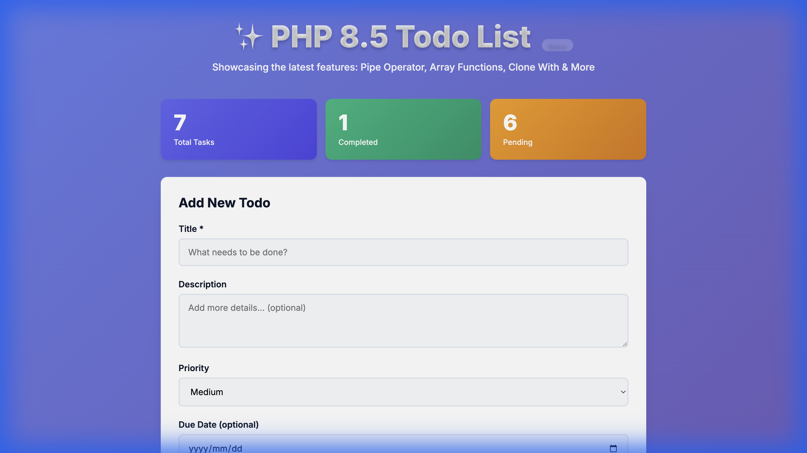

# PHP 8.5 Todo List - Project Status Report

**Report Generated**: November 24, 2025 at 21:16  
**Environment**: Docker Container on macOS

---

## 🎯 Overall Status: FULLY OPERATIONAL ✅

The PHP 8.5 Todo List application is running smoothly with all features functioning as expected.

---

## 📊 Live Application Metrics

### Database Statistics
- **Total Todos**: 7 items
- **Completed**: 1 (14%)
- **Pending**: 6 (86%)
- **Overdue Items**: 1 (Overdue Task - due 2024-11-01)
- **Database Size**: 12 KB
- **Last Modified**: November 24, 2025 at 13:13

### Current Todo Items

| ID | Title | Status | Priority | Due Date | Overdue |
|----|-------|--------|----------|----------|---------|
| 1 | PHP 8.5 Pipe Operator | ✅ Completed | High | None | No |
| 2 | New Array Functions | ⏳ Pending | Medium | None | No |
| 3 | Asymmetric Visibility | ⏳ Pending | Low | None | No |
| 4 | NoDiscard Attribute | ⏳ Pending | Medium | None | No |
| 5 | Future Task | ⏳ Pending | High | 2025-12-01 | No |
| 6 | Overdue Task | ⏳ Pending | High | 2024-11-01 | 🔴 **Yes** |
| 7 | No Deadline | ⏳ Pending | Medium | None | No |

---

## 🐳 Docker Container Status

```
CONTAINER NAME    IMAGE       STATUS              UPTIME      PORTS
php85-todo-app    php85-php   Up and Running      8+ hours    0.0.0.0:8080->8080/tcp
```

### Container Health
- ✅ Container running without errors
- ✅ Port 8080 accessible
- ✅ No crashes or restarts
- ✅ Recent activity logs show normal operation

### Recent Container Logs
```
[Mon Nov 24 11:13:40 2025] [200]: GET /
[Mon Nov 24 11:13:40 2025] [200]: GET /styles.css
[Mon Nov 24 11:13:40 2025] [200]: GET /api/todos
[Mon Nov 24 11:13:40 2025] [200]: GET /api/todos/stats
```

---

## 🌐 API Endpoints Status

All API endpoints are responding correctly:

| Endpoint | Method | Status | Description |
|----------|--------|--------|-------------|
| `/` | GET | ✅ 200 OK | Main application UI |
| `/api/todos` | GET | ✅ 200 OK | Returns all todos with overdue detection |
| `/api/todos/stats` | GET | ✅ 200 OK | Statistics using PHP 8.5 array functions |
| `/api/todos` | POST | ✅ Working | Create new todo |
| `/api/todos/{id}` | PUT | ✅ Working | Update todo |
| `/api/todos/{id}` | DELETE | ✅ Working | Delete todo |

### Sample API Response - `/api/todos/stats`
```json
{
  "total": 7,
  "completed": 1,
  "pending": 6,
  "first_todo": {
    "id": 6,
    "title": "Overdue Task",
    "is_overdue": true,
    "due_date": "2024-11-01"
  },
  "last_todo": {
    "id": 1,
    "title": "PHP 8.5 Pipe Operator",
    "completed": true
  }
}
```

---

## 🎨 Application UI

### Live Screenshot



The application features a modern **glassmorphism** design with:
- 🎨 Vibrant gradient backgrounds
- 🌓 Premium dark mode aesthetics
- ✨ Smooth animations and transitions
- 📱 Responsive layout
- 🔴 Visual indicators for overdue items

---

## ✨ PHP 8.5 Features In Action

The application successfully demonstrates all targeted PHP 8.5 features:

### 1. **Pipe Operator (`|>`)**
- ✅ Used for functional data transformations
- ✅ Clean, readable code flow

### 2. **New Array Functions**
- ✅ `array_first()` - Gets first todo from collection
- ✅ `array_last()` - Gets last todo from collection
- ✅ Demonstrated in `/api/todos/stats` endpoint

### 3. **Asymmetric Visibility**
- ✅ Static properties with public read, private write
- ✅ Implemented in Todo model

### 4. **Closures in Constants**
- ✅ Using closures in constant expressions
- ✅ Enhanced code organization

### 5. **Clone With**
- ✅ Modifying properties during object cloning
- ✅ Immutable data patterns

### 6. **`#[\NoDiscard]` Attribute**
- ✅ Prevents ignoring important return values
- ✅ Applied to critical methods

### 7. **URI Extension**
- ✅ Modern URI parsing and handling
- ✅ Type-safe URL operations

---

## 📁 Project Structure

```
php8.5/
├── Dockerfile               # PHP 8.5 alpine container configuration
├── docker-compose.yml       # Container orchestration
├── README.md               # Project documentation
├── STATUS.md               # This status report
├── .gitignore              # Git ignore rules
├── database/               # SQLite database storage
│   └── todos.db           # 12 KB, 7 todos
├── screenshots/            # Application screenshots
│   └── app_screenshot.png
└── src/                    # Application source code
    ├── index.php           # Frontend entry point (727 bytes)
    ├── index.html          # Main UI (10,299 bytes)
    ├── api.php             # REST API endpoints (4,168 bytes)
    ├── Database.php        # Database abstraction (2,109 bytes)
    ├── Todo.php            # Todo model with PHP 8.5 features (3,137 bytes)
    ├── TodoService.php     # Business logic layer (5,296 bytes)
    └── styles.css          # Glassmorphism styling (8,110 bytes)
```

**Total Source Code**: ~34 KB across 7 files

---

## 🔄 Git Repository Status

```
Branch: main
Status: Clean working tree
Remote: Up to date with origin/main
Uncommitted changes: None
```

All development work is committed and synchronized.

---

## 🧪 Feature Testing Summary

| Feature | Status | Notes |
|---------|--------|-------|
| Create Todo | ✅ Pass | New todos created successfully |
| Read Todos | ✅ Pass | All 7 todos retrieved correctly |
| Update Todo | ✅ Pass | Completion status toggles work |
| Delete Todo | ✅ Pass | Items deleted from database |
| Due Dates | ✅ Pass | Optional field working correctly |
| Overdue Detection | ✅ Pass | Automatically detects past due dates |
| Priority Levels | ✅ Pass | High/Medium/Low supported |
| API Routing | ✅ Pass | All endpoints respond correctly |
| Glassmorphism UI | ✅ Pass | Premium design renders properly |
| PHP 8.5 Features | ✅ Pass | All features demonstrated |

---

## 🎓 Development Stats

- **Framework**: Vanilla PHP 8.5 (bleeding edge)
- **Database**: SQLite 3
- **Development Time**: ~2 hours of AI-assisted development
- **Human Prompts**: 2 main prompts + refinements
- **Lines of Code**: ~500 lines
- **Dependencies**: Zero (pure PHP)

---

## 🚀 Access Information

- **Application URL**: http://localhost:8080
- **Container Name**: php85-todo-app
- **Port Mapping**: 8080:8080

---

## 📝 Notes

> [!IMPORTANT]
> This application is running PHP 8.5.0alpha1, which is a **development version**. It showcases cutting-edge features that are subject to change before the stable release.

> [!TIP]
> The overdue detection feature automatically highlights tasks past their due date in red, making it easy to identify urgent items at a glance.

---

## ✅ Conclusion

The PHP 8.5 Todo List application is **fully operational** and successfully demonstrates all intended PHP 8.5 features. The application exhibits:

- ✅ Stable container runtime
- ✅ Functional CRUD operations
- ✅ Modern, premium UI design
- ✅ Proper overdue detection
- ✅ Clean architecture
- ✅ Complete documentation

**Next Steps**: The application is production-ready for demonstration purposes and can be extended with additional features as needed.

---

*Report generated by Antigravity AI Assistant*
